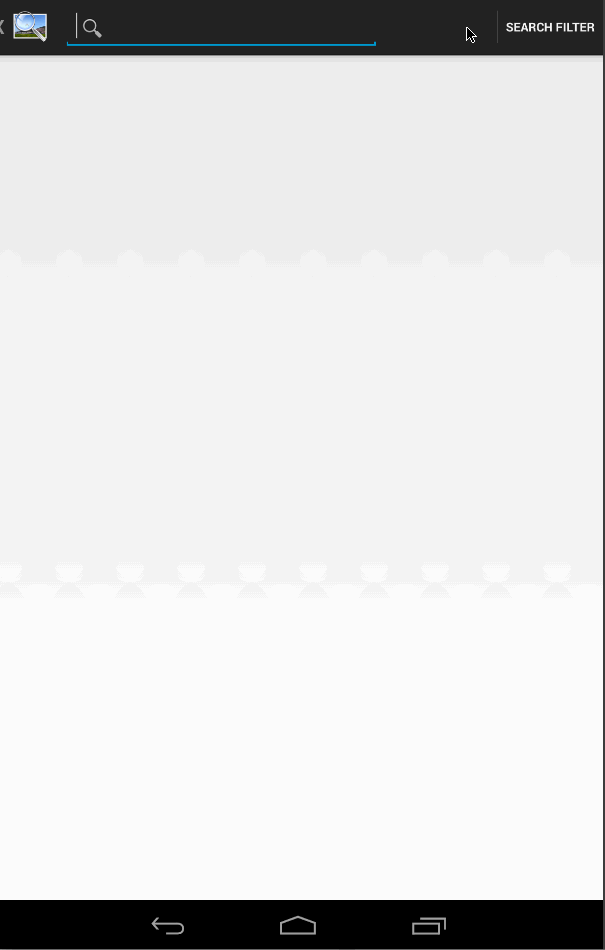

# Effort
Est. 7 hours

# User Stories

The following user stories were completed:

Mandatory:

1. User can enter a search query that will display a grid of image results from the Google Image API.
1. User can click on "settings" which allows selection of advanced search options to filter results
1. User can configure advanced search filters for size/color/type/site
1. Subsequent searches will have any filters applied to the search results
1. User can tap on any image in results to see the image full-screen
1. User can scroll down “infinitely” to continue loading more image results (up to 8 pages)

Advanced:

1. Use the ActionBar SearchView or custom layout as the query box instead of an EditText
1. User can share an image to their friends or email it to themselves
1. Bonus: User can zoom or pan images displayed in full-screen detail view

# Walkthrough

